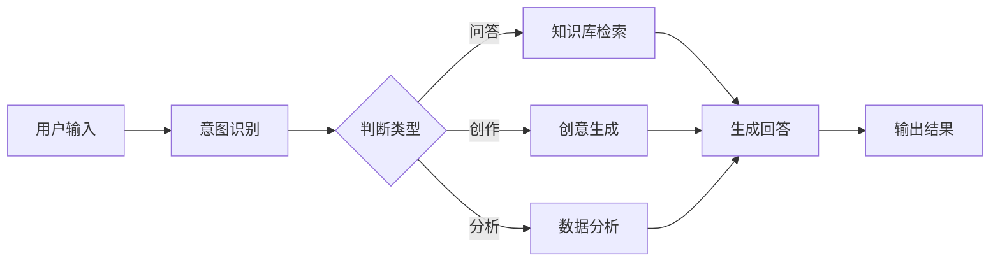
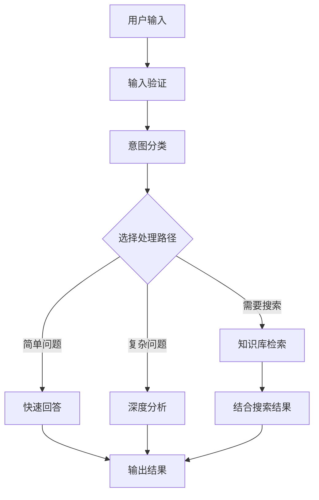

## 平台简介

Dify 是一个开源的 LLM 应用开发平台，让您能够快速搭建 AI 应用。通过 老张API，您可以在 Dify 中使用各种主流 AI 模型。

## 快速集成

### 1. 获取 API 密钥

访问 [老张API控制台](https://vip.laozhang.ai) 获取您的 API 密钥。

### 2. 配置模型供应商

1. 登录 Dify 平台
2. 点击用户名 > 设置
3. 选择"模型供应商" - 选择 OpenAI-API-compatible
4. 根据模型类型选择配置方式


#### 所有模型，包括 GPT、Claude、Gemini 模型配置

- 模型类型：选择 LLM 类型（第一个栏目，图略）
- 模型名称：需要输入**模型规范名称**，不能乱输入
  - 举例：输入 gemini-2.5-flash  而不能输入 Gemini 2.5 Flash。

- 模型显示名称：可以随意，方便辨识即可，比如可以写 Gemini 2.5 Flash
- **API Key**：输入 [老张API 密钥](https://api.laozhang.ai/token)
- **API endpoint URL**：`https://api.laozhang.ai/v1`
- API endpoint中的模型名称，写规范名称：gemini-2.5-flash


模型配置里有很多参数按**实际情况**更新：

注：Dify 的模型配置界面并没有**与时俱进**，比如大模型的上下文长度的默认值写的 4096 是比较小的数值。

每个大模型的具体上下文长度，可以参考各大官方文档（本文档中心-资源导航栏目）


还有更多参数


## 核心功能

### 对话助手

创建智能对话助手：

1. 选择"对话助手"模板
2. 配置系统提示词：
```text
你是一个专业的客服助手，负责：
- 回答用户问题
- 提供产品信息
- 处理售后服务
请保持友好和专业的态度。
```
3. 选择合适的模型（如 GPT-4）
4. 调整参数：
   - 温度：0.7（平衡创造性和准确性）
   - 最大输出：2000 tokens

### 工作流应用

构建复杂的 AI 工作流：



### 知识库问答

集成文档知识库：

1. 创建知识库
2. 上传文档（PDF、Word、Markdown）
3. 选择嵌入模型：`text-embedding-ada-002`
4. 在应用中引用知识库
5. 配置检索参数：
   - 检索数量：3-5 个片段
   - 相似度阈值：0.7
   - 重排序：开启

## 应用类型

### 1. 聊天助手

```yaml
应用类型: 对话助手
模型: gpt-4
系统提示: |
  你是一个专业的AI助手，具备以下能力：
  - 回答各种问题
  - 协助解决问题
  - 提供建议和指导
  
  请始终保持友好、准确、有帮助的态度。
温度: 0.7
最大长度: 2000
```

### 2. 文档分析

```yaml
应用类型: 工作流
输入: 上传文档
处理流程:
  1. 文档解析
  2. 内容提取
  3. 结构化分析
  4. 生成摘要
输出: 分析报告
```

### 3. 代码助手

```yaml
应用类型: 对话助手  
模型: gpt-4
系统提示: |
  你是一个专业的编程助手，专长：
  - 代码编写和优化
  - 错误调试
  - 架构设计
  - 最佳实践建议
  
  请提供清晰、实用的代码解决方案。
```

## 高级功能

### API 集成

Dify 应用可以通过 API 调用：

```python
import requests

url = "https://your-dify-instance/v1/chat-messages"
headers = {
    "Authorization": "Bearer YOUR_APP_API_KEY",
    "Content-Type": "application/json"
}

data = {
    "inputs": {},
    "query": "你好，请介绍一下你自己",
    "response_mode": "streaming",
    "user": "user_123"
}

response = requests.post(url, headers=headers, json=data)
```

### 批量处理

处理大量数据：

1. 准备 CSV 文件
2. 创建批处理任务
3. 配置处理模板
4. 执行批量任务
5. 导出结果

### 多模态应用

支持文本和图像的混合处理：

```python
# 多模态输入示例
{
    "inputs": {
        "image": "data:image/jpeg;base64,...",
        "text": "分析这张图片中的内容"
    },
    "query": "请详细描述图片内容并提供分析"
}
```

## 模型选择策略

### 按场景选择

| 应用场景 | 推荐模型 | 理由 |
|---------|---------|------|
| 客服助手 | GPT-3.5-Turbo | 响应快、成本低 |
| 内容创作 | Claude 3 Sonnet | 创造力强 |
| 代码助手 | GPT-4 | 逻辑准确 |
| 文档分析 | Claude 3 Opus | 长文本理解好 |
| 数据分析 | GPT-4 | 推理能力强 |

### 成本优化

```yaml
开发环境:
  模型: gpt-3.5-turbo
  最大长度: 1000
  温度: 0.7

生产环境:
  模型: gpt-4
  最大长度: 2000
  温度: 0.5
```

## 最佳实践

### 1. 提示词优化

```text
# 结构化提示词
## 角色定义
你是一个专业的[具体角色]

## 任务说明
请帮助用户[具体任务]

## 输出格式
请按以下格式输出：
1. 概述
2. 详细分析
3. 建议

## 约束条件
- 回答要准确
- 语言要通俗
- 长度控制在500字内
```

### 2. 工作流设计



### 3. 监控和优化

定期检查：
- 用户满意度反馈
- 响应时间统计
- 成本使用情况
- 错误率分析

### 4. 版本管理

- 定期备份应用配置
- 测试新版本后再发布
- 保留多个版本以便回滚

## 故障排除

### 常见问题

#### 模型调用失败
- 检查 API 密钥正确性
- 确认账户余额充足
- 验证网络连接

#### 响应质量差
- 优化提示词设计
- 调整模型参数
- 增加上下文信息

#### 性能问题
- 选择更快的模型
- 减少输出长度限制
- 启用缓存功能

### 性能优化

```yaml
缓存设置:
  启用: true
  过期时间: 3600秒
  缓存条件: 相同输入

并发控制:
  最大并发: 10
  队列大小: 100
  超时时间: 30秒

资源限制:
  内存限制: 2GB
  CPU限制: 80%
```

## 部署建议

### 生产环境

```yaml
# docker-compose.yml
version: '3.8'
services:
  dify-api:
    image: langgenius/dify-api:latest
    environment:
      - SECRET_KEY=your-secret-key
      - DB_HOST=postgres
      - REDIS_HOST=redis
      - OPENAI_API_KEY=your-laozhang-key
      - OPENAI_API_BASE=https://api.laozhang.ai/v1
    depends_on:
      - postgres
      - redis
  
  dify-web:
    image: langgenius/dify-web:latest
    ports:
      - "3000:3000"
    depends_on:
      - dify-api
  
  postgres:
    image: postgres:14
    environment:
      - POSTGRES_DB=dify
      - POSTGRES_USER=dify
      - POSTGRES_PASSWORD=password
  
  redis:
    image: redis:alpine
```

### 安全配置

- 使用环境变量存储敏感信息
- 启用 HTTPS 访问
- 设置访问权限控制
- 定期更新依赖包

### 监控设置

```python
# 监控脚本示例
import requests
import time

def monitor_dify_health():
    try:
        response = requests.get("http://your-dify-instance/health")
        if response.status_code == 200:
            print("Dify 运行正常")
        else:
            print(f"Dify 异常，状态码: {response.status_code}")
    except Exception as e:
        print(f"监控失败: {e}")

# 每分钟检查一次
while True:
    monitor_dify_health()
    time.sleep(60)
```

需要更多帮助？请查看 [详细集成文档](/api-reference/integrations/dify)。